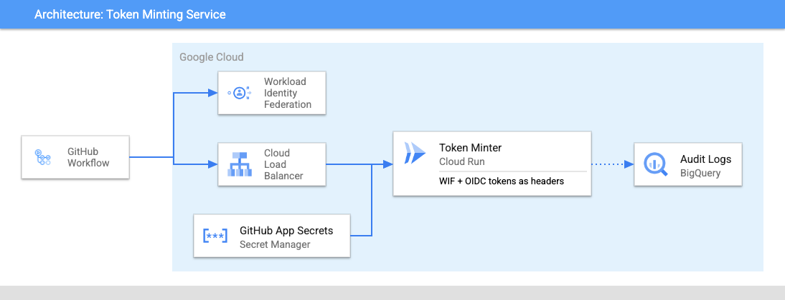

# GitHub Token Minter

GitHub Token Minter (Minty) is a service that acts as a GitHub App that can generate tokens with elevated privileges to allow a GitHub workflow to act upon other private repositories in an organization or on organization level resources such GitHub teams.

This documents the current state of `github-token-minter` as of v2.x. For details on legacy deployments check the document at [docs/legacy/README.md](./docs/legacy/README.md).

If you are looking to migrate to v2.x from a v0.x release please see the migration guide at [docs/migration/README.md](./docs/migration/README.md).

## Architecture



## Setup

### Create a GitHub App and Install it

Follow the steps to [create a new GitHub App](https://docs.github.com/en/apps/creating-github-apps/creating-github-apps/creating-a-github-app). You'll want to capture the `application id` and `private key` that are generated during the creation process.

Once created it needs to be [installed](https://docs.github.com/en/apps/using-github-apps/installing-an-app-in-your-organization) in your organziation. When installing you will grant the app the level of access you deem that it needs.

### Deploy the service

You can use the provided [Terraform module](../terraform/)  to setup the basic infrastructure needed for this service. You can refer to the provided module to see how to build your own Terraform from scratch.

```terraform
module "github_token_minter" {
  source = "git::https://github.com/abcxyz/github-token-minter.git//terraform?ref=main" # Should pin this to a SHA

  project_id = "YOUR PROJECT ID"

  domain     = "YOUR DOMAIN NAME"
  dataset_id = "NAME OF YOUR AUDIT DATASET"
  service_iam = {
    admins = []
    developers = [
      "serviceAccount:<YOUR CI SERVICE ACCOUNT>@<YOUR PROJECT ID>.iam.gserviceaccount.com",
    ]
    invokers = [
      "serviceAccount:<YOUR WIF SERVICE ACCOUNT>@<YOUR PROJECT ID>.iam.gserviceaccount.com",
    ]
  }
  dataset_iam = {
    owners = ["group:<some group>@<your org>.com"]
    editors = [
        "serviceAccount:<YOUR WIF SERVICE ACCOUNT>@<YOUR PROJECT ID>.iam.gserviceaccount.com",
    ]
    viewers = ["group:<some other group>@<your org>.com"]
  }
}
```

### Service Configuration

The service relies on a number of environment variables. Most of them have defaults that map to the public GitHub environment and are exposed only to allow customers who use private GitHub Enterprise environments to configure them.

The two that are not optional are the `GITHUB_APP_ID` and the `GITHUB_PRIVATE_KEY`.

Both of those values come from [creating and installing](https://docs.github.com/en/apps/creating-github-apps/creating-github-apps/creating-a-github-app) your GitHub app within your organization. These values are sensitive and must be treated as secrets. The default Terraform module stores them in Secret Manager and they are mapped into the Cloud Run service from there.

ENV VAR name                       | Description
-----------------------------------| -----------
GITHUB_APP_ID                      | GitHub App Id created following the app creation instructions at <https://docs.github.com/en/developers/apps/building-github-apps/creating-a-github-app>
GITHUB_PRIVATE_KEY                 | Private key generated as part of the GitHub App creation
GITHUB_API_BASE_URL                | GitHubAPIBaseURL is the base URL for the GitHub installation. It should include the protocol (https://) and no trailing slashes.
PORT                               | Port to run the service on. Defaults to `8080`
CONFIGS_DIR                        | Location of local configuration files on the filesystem. Defaults to `configs`
ISSUER_ALLOWLIST                   | The list of OIDC token issuers that GitHub Token Minter will accept. Defaults to accepting GitHub and Google tokens.
JWKS_CACHE_DURATION                | The duration for which to cache the JWKS for an OIDC token issuer.
REPO_CONFIG_PATH                   | The location within a repository to look for configuration files. Defaults to .github/minty.yaml
ORG_CONFIG_REPO                    | The respository that contains the configuration file for an organization. Defaults to .google-github
ORG_CONFIG_PATH                    | The location within an organization to look for configuration files. Defaults to minty.yaml
REF                                | The ref (sha, branch, etc.) to look for configuration files at. Defaults to main

### Configuring Repository Access

**NOTE**: We recommend that configuration for single repository access is stored within that repository and configuration that spans multiple repositories is stored in a protected organization repository, typically named `.google-github`.

Each repository that needs to mint a token must be configured with an allowed set of permissions. Any request from a repository that is not configured will default to denying all access.

Each configuration file can have 1 or more rules that it can match against and it will evaluate them in order, top down, until it finds a matching condition.

The repository configuration file looks like below and is made up of two primary sections:

```yaml
# github-token-minter/.github/minty.yaml

version: 'minty.abcxyz.dev/v2'

rule:
  if: |-
    (
      assertion.iss == issuers.github &&
      assertion.repository_owner_id == '93787867' &&
      assertion.repository_id == '576289489'
    ) || (
      assertion.iss == issuers.google &&
      assertion.email == "github-automation-bot@gha-ghtm-ci-i-647d53.iam.gserviceaccount.com" // integration CI service account
    )

scope:
  create-tag:
    rule:
      if: |-
        assertion.job_workflow_ref == "abcxyz/pkg/.github/workflows/create-tag.yml@refs/heads/main" &&
        assertion.workflow_ref.startsWith("abcxyz/github-token-minter/.github/workflows/create-tag.yml") &&
        assertion.ref == 'refs/heads/main' &&
        assertion.event_name == 'workflow_dispatch'
    repositories:
      - 'github-token-minter'
    permissions:
      contents: 'write'

  integ:
    rule:
      if: |-
        assertion.workflow_ref.startsWith("abcxyz/github-token-minter/.github/workflows/ci.yml") || (
          assertion.iss == issuers.google &&
          assertion.email == "github-automation-bot@gha-ghtm-ci-i-647d53.iam.gserviceaccount.com" // integration CI service account
        )
    repositories:
      - 'github-token-minter'
    permissions:
      issues: 'read'
```

#### Rule

The `rule` statement is a top level filter which is applied first to ensure that requests meet a minimun standard required by this repository. This typically denotes which issuers are permitted, what organization is allowed access and which repositories.

As you can see in the `minty.yaml` file in this repository, this rule only allows requests from GitHub if they come from the `abcxyz` organization (referenced by id to prevent name squatting attacks), and that the request to come from the repository id for `github-token-minter`, there is an additionl OR statement that allows access from a particular GCP service account (more details on that below).

The `if` clause uses the [Google Common Expression Language](https://github.com/google/cel-spec) to match an inbound OIDC token against a series of rules. Any attributes from the assertion object are available to match against and you can make this expression as simple or complicated as required.

The object mirrors what is available in an OIDC token for a GitHub Workflow, below is an example token.

```json
{
  "jti": "example-id",
  "sub": "repo:octo-org/octo-repo:environment:prod",
  "environment": "prod",
  "aud": "https://github.com/octo-org",
  "ref": "refs/heads/main",
  "sha": "example-sha",
  "repository": "octo-org/octo-repo",
  "repository_owner": "octo-org",
  "actor_id": "12",
  "repository_visibility": "private",
  "repository_id": "74",
  "repository_owner_id": "65",
  "run_id": "example-run-id",
  "run_number": "10",
  "run_attempt": "2",
  "actor": "octocat",
  "workflow": "example-workflow",
  "head_ref": "",
  "base_ref": "",
  "event_name": "workflow_dispatch",
  "ref_type": "branch",
  "job_workflow_ref": "octo-org/octo-automation/.github/workflows/oidc.yml@refs/heads/main",
  "iss": "https://token.actions.githubusercontent.com",
  "nbf": 1632492967,
  "exp": 1632493867,
  "iat": 1632493567
}
```

OIDC tokens for Google Cloud Service Accounts are also accepted. These tokens include fewer claims and can be distinguished by the issuer field `iss`, example below. Note that GitHub tokens include a `repository` claim, but Google tokens specify the repository using the audience claim `aud`.

```json
{
  "aud": "testorg/testrepo",
  "azp": "123456789012345678901",
  "email": "example-service-account@example-project-id.iam.gserviceaccount.com",
  "email_verified": "true",
  "exp": "1729210450",
  "iat": "1729206850",
  "iss": "https://accounts.google.com",
  "sub": "123456789012345678901",
  "alg": "RS256",
  "kid": "ffffffffffffffffffffffffffffffffffffffff",
  "typ": "JWT"
}
```

#### Scopes

The scopes section contains named entry points into the configuration file. Each request contains a `scope` parameter which directs the service to look at the particular rules defined by that scope.

As you can see from the example, the `create-tag` scope defines another `if` statement which is used to verify that the caller is permitted to request this scope.

The `repositories` and `permissions` attributes mirror the schema defined for [requesting a GitHub app installation access token](https://docs.github.com/en/rest/apps/apps?apiVersion=2022-11-28#create-an-installation-access-token-for-an-app).

* Repositories is an array of strings representing the name of the repository. The repository attribute supports a prefix wildcard match so you can select multiple repositories at once. A single `*` would capture all repositories for the organization but something like `github-*` would only capture repositories that started with `github-`. For single level repository configuration this field can be omitted and it will default to the current repository.

* Permissions is a map of permission name to access level. For example, to generate a token that can read issues you would specify `"issues": "read"`.

## Using the service

The service provides a GitHub action that can be used to access the service from a GitHub workflow.

It is located in the [.github/actions/minty](.github/actions/minty) directory of this repository.

The action requires a the caller to first authenticate with Google Cloud using the [google-github-actions/auth](https://github.com/google-github-actions/auth) action like this:

```yaml
      - id: 'minty-auth'
        uses: 'google-github-actions/auth@6fc4af4b145ae7821d527454aa9bd537d1f2dc5f' # ratchet:google-github-actions/auth@v2
        with:
          create_credentials_file: false
          export_environment_variables: false
          workload_identity_provider: '${{ vars.TOKEN_MINTER_WIF_PROVIDER }}'
          service_account: '${{ vars.TOKEN_MINTER_WIF_SERVICE_ACCOUNT }}'
          token_format: 'id_token'
          id_token_audience: '${{ vars.TOKEN_MINTER_SERVICE_AUDIENCE }}'
          id_token_include_email: true
```

The main parameters are the `workload_identity_provider` and `service_account` you want to authenticate with and the `service_audience` that the `github-token-minter` server expects for your environment.

Once you have authenticated you then call the `minty` action like this:

```yaml
      - id: 'mint-token'
        uses: 'abcxyz/github-token-minter/.github/actions/minty@main' # ratchet:exclude
        with:
          id_token: '${{ steps.minty-auth.outputs.id_token }}'
          service_url: '${{ vars.TOKEN_MINTER_SERVICE_URL }}'
          requested_permissions: |-
            {
              "scope": "draft-release",
              "repositories": ["${{ github.event.repository.name }}"],
              "permissions": {
                "pull_requests": "write",
                "contents": "write"
              }
            }
```

As you can see, the `id_token` is passed from the `auth` action along with the url of the cloud run service where `github-token-minter` is deployed.

The final parameter is the request object itself, it contains the `scope` that is being targeted, a optional set of repositories that the workflow is requesting access to (this defaults to the current repo) and the set of permissions that the workflow requires. The permissions map can be a subset of the permissions defined in the config file or can be omitted to request whatever permissions are defined for the scope.

## Example Workflow

```yaml
 use-a-token-example:
    runs-on: 'ubuntu-latest'
    needs:
      - 'deployment'
    permissions:
      contents: 'write'
      packages: 'write'
      id-token: 'write'
    steps:
      - name: 'Checkout'
        uses: 'actions/checkout@ac593985615ec2ede58e132d2e21d2b1cbd6127c' # ratchet:actions/checkout@v3
      - id: 'minty-auth'
        uses: 'google-github-actions/auth@6fc4af4b145ae7821d527454aa9bd537d1f2dc5f' # ratchet:google-github-actions/auth@v2
        with:
          create_credentials_file: false
          export_environment_variables: false
          workload_identity_provider: '${{ vars.TOKEN_MINTER_WIF_PROVIDER }}'
          service_account: '${{ vars.TOKEN_MINTER_WIF_SERVICE_ACCOUNT }}'
          token_format: 'id_token'
          id_token_audience: '${{ vars.TOKEN_MINTER_SERVICE_AUDIENCE }}'
          id_token_include_email: true
      - id: 'mint-token'
        uses: 'abcxyz/github-token-minter/.github/actions/minty@main' # ratchet:exclude
        with:
          id_token: '${{ steps.minty-auth.outputs.id_token }}'
          service_url: '${{ vars.TOKEN_MINTER_SERVICE_URL }}'
          requested_permissions: |-
            {
              "scope": "read-issues",
              "repositories": ["${{ github.event.repository.name }}"],
              "permissions": {
                "issues": "read"
              }
            }

      - name: 'list-issues'
        run: |
          curl --fail \
            -H "Accept: application/vnd.github+json" \
            -H "Authorization: Bearer ${{ steps.mint-token.outputs.token }}"\
            -H "X-GitHub-Api-Version: 2022-11-28" \
            https://api.github.com/repos/abcxyz/github-token-minter/issues/events
```
