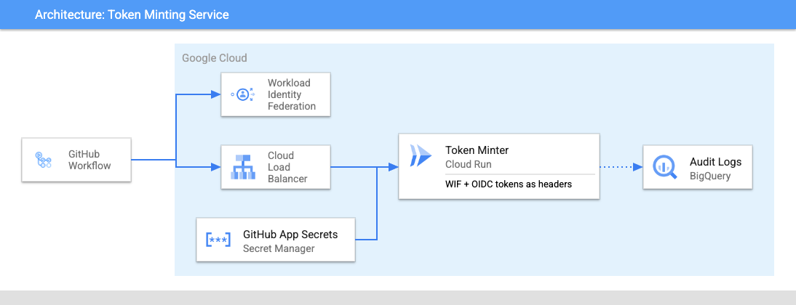

# GitHub Token Minter

Service that acts as a GitHub App that can generate tokens with elevated privileges to allow a GitHub workflow to act upon other private repositories in an organization or on organization level resources such GitHub teams.

## Architecture



## Setup

### Create a GitHub App and Install it

Follow the steps to [create a new GitHub App](https://docs.github.com/en/apps/creating-github-apps/creating-github-apps/creating-a-github-app). You'll want to capture the `application id` and `private key` that are generated during the creation process.

Once created it needs to be [installed](https://docs.github.com/en/apps/using-github-apps/installing-an-app-in-your-organization) in your organziation. When installing you will grant the app the level of access you deem that it needs. At this stage you need to capture your `installation id`.

### Deploy the service

You can use the provided [Terraform module](../terraform/)  to setup the basic infrastructure needed for this service. You can refer to the provided module to see how to build your own Terraform from scratch.

```terraform
module "github_token_minter" {
  source = "git::https://github.com/abcxyz/github-token-minter.git//terraform?ref=main" # Should pin this to a SHA

  project_id = "YOUR PROJECT ID"

  domain     = "YOUR DOMAIN NAME"
  dataset_id = "NAME OF YOUR AUDIT DATASET"
  service_iam = {
    admins = []
    developers = [
      "serviceAccount:<YOUR CI SERVICE ACCOUNT>@<YOUR PROJECT ID>.iam.gserviceaccount.com",
    ]
    invokers = [
      "serviceAccount:<YOUR WIF SERVICE ACCOUNT>@<YOUR PROJECT ID>.iam.gserviceaccount.com",
    ]
  }
  dataset_iam = {
    owners = ["group:<some group>@<your org>.com"]
    editors = [
        "serviceAccount:<YOUR WIF SERVICE ACCOUNT>@<YOUR PROJECT ID>.iam.gserviceaccount.com",
    ]
    viewers = ["group:<some other group>@<your org>.com"]
  }
}
```

### Service Configuration

The service relies on a number of environment variables. Most of them have defaults that map to the public GitHub environment and are exposed only to allow customers who use private GitHub Enterprise environments to configure them.

The three that are not optional are the `GITHUB_APP_ID` and the `GITHUB_INSTALL_ID` and the `GITHUB_PRIVATE_KEY`.

All three of those values come from [creating and installing](https://docs.github.com/en/apps/creating-github-apps/creating-github-apps/creating-a-github-app) your GitHub app within your organization. These values are sensitive and must be treated as secrets. The default Terraform module stores them in Secret Manager and they are mapped into the Cloud Run service from there.

ENV VAR name                       | Description
-----------------------------------| -----------
GITHUB_APP_ID                      | GitHub App Id created following the app creation instructions at <https://docs.github.com/en/developers/apps/building-github-apps/creating-a-github-app>
GITHUB_PRIVATE_KEY                 | Private key generated as part of the GitHub App creation
GITHUB_INSTALL_ID                  | GitHub Installation Id generated by installing the app via <https://docs.github.com/en/developers/apps/managing-github-apps/installing-github-apps>
GITHUB_JKWS_URL                    | JWKS endpoint to use to verify JWTs from GitHub. Defaults to `https://token.actions.githubusercontent.com/.well-known/jwks`
GITHUB_API_BASE_URL                | GitHubAPIBaseURL is the base URL for the GitHub installation. It should include the protocol (https://) and no trailing slashes.
PORT                               | Port to run the service on. Defaults to `8080`
CONFIGS_DIR                        | Location of repository configuration files. Defaults to `configs`

### Configuring Repository Access

Each repository that needs to mint a token must be configured with an allowed set of permissions. Any request from a repository that is not configured will default to denying all access.

Each configuration file can have 1 or more rules that it can match against and it will evaluate them in order, top down, until it finds a matching condition.

The repository configuration file looks like below and is made up of three primary sections:

```yaml
# abcxyz/github-token-minter.yaml
-
  if: 'assertion.workflow_ref.startsWith("abcxyz/github-token-minter/.github/workflows/ci.yml")'
  repositories:
    - 'github-token-minter'
  permissions:
    issues: 'read'
```

The `if` clause uses the [Google Common Expression Language](https://github.com/google/cel-spec) to match an inbound OIDC token against a series of rules. Any attributes from the assertion object are available to match against and you can make this expression as simple or complicated as required.

The object mirrors what is available in an OIDC token for a GitHub Workflow, below is an example token.

```json
{
  "jti": "example-id",
  "sub": "repo:octo-org/octo-repo:environment:prod",
  "environment": "prod",
  "aud": "https://github.com/octo-org",
  "ref": "refs/heads/main",
  "sha": "example-sha",
  "repository": "octo-org/octo-repo",
  "repository_owner": "octo-org",
  "actor_id": "12",
  "repository_visibility": "private",
  "repository_id": "74",
  "repository_owner_id": "65",
  "run_id": "example-run-id",
  "run_number": "10",
  "run_attempt": "2",
  "actor": "octocat",
  "workflow": "example-workflow",
  "head_ref": "",
  "base_ref": "",
  "event_name": "workflow_dispatch",
  "ref_type": "branch",
  "job_workflow_ref": "octo-org/octo-automation/.github/workflows/oidc.yml@refs/heads/main",
  "iss": "https://token.actions.githubusercontent.com",
  "nbf": 1632492967,
  "exp": 1632493867,
  "iat": 1632493567
}
```

The `repositories` and `permissions` attributes mirror the schema defined for [requesting a GitHub app installation access token](https://docs.github.com/en/rest/apps/apps?apiVersion=2022-11-28#create-an-installation-access-token-for-an-app).

* Repositories is an array of strings representing the name of the repository. Since the GitHub app only services a single organization per installation you do not need to specify the organization name as part of the repository name. E.g. `github-token-minter` instead of `abcxyz/github-token-minter`. The repository attribute supports a prefix wildcard match so you can select multiple repositories at once. A single `*` would capture all repositories for the organization but something like `github-*` would only capture repositories that started with `github-`.

* Permissions is a map of permission name to access level. For example, to generate a token that can read issues you would specify `"issues": "read"`.

### Deploying configuration to your service

The container built in this repository contains only the bare bones configuration required for the integration tests in our CI environment. All other repository configuration is stored outside of this repository and needs to be added into the container at deployment time.

We recommend that a GitHub workflow builds a new container from the released image produced by this repository that layers in your configuration files before it is deployed.

Given a repository setup like

```bash
<my repo root>
-- configs
   -- repo1_config.yml
   -- repo2_config.yml
Dockerfile
```

A Dockerfile paired with a short GitHub workflow is sufficient.

*Examples:*

```Dockerfile
ARG VERSION=v0.0.8-amd64
FROM us-docker.pkg.dev/abcxyz-artifacts/docker-images/github-token-minter-server:$VERSION

COPY configs /configs
```

```yaml
env:
    NEW_IMAGE_NAME: 'my-token-minter:v3.0.0'
jobs:
  image-release:
    runs-on: 'ubuntu-latest'
    permissions:
      contents: 'read'
      id-token: 'write'
    steps:
      - name: 'Checkout'
        uses: 'actions/checkout@v3'
      - name: 'Build release image and push to Release registry'
        uses: 'docker/build-push-action@v2'
        with:
          push: true
          tags: '${{ env.NEW_IMAGE_NAME }}'
```

## Using the service

The service provides a composite GitHub action that can be used to access the service from a GitHub workflow.

It is located in the [.github/actions/mint-token](.github/actions/mint-token) directory of this repository.

The action requires a handful of parameters

```yaml
  wif_provider:
    description: 'Workload identity federation provider.'
    required: true
  wif_service_account:
    description: 'Workload identity federation service account.'
    required: true
  service_audience:
    description: 'Cloud Run audience for the production github-token-minter service'
    required: true
  service_url:
    description: 'URL for the production github-token-minter service'
    required: true
  requested_permissions:
    description: 'Permission request information in the form {"repositories":["github-token-minter"],"permissions":{"issues":"read"}}'
    required: true
```

Example usage of the action in a workflow

```yaml
 use-a-token-example:
    runs-on: 'ubuntu-latest'
    needs:
      - 'deployment'
    permissions:
      contents: 'write'
      packages: 'write'
      id-token: 'write'
    steps:
      - name: 'Checkout'
        uses: 'actions/checkout@ac593985615ec2ede58e132d2e21d2b1cbd6127c' # ratchet:actions/checkout@v3
      - id: 'mint-token'
        uses: './.github/actions/mint-token'
        with:
          wif_provider: '${{ env.WIF_PROVIDER }}'
          wif_service_account: '${{ env.WIF_SERVICE_ACCOUNT }}'
          service_audience: '${{ env.SERVICE_AUDIENCE }}'
          service_url: '${{ env.SERVICE_URL }}'
          requested_permissions: '{"repositories":["github-token-minter"],"permissions":{"issues":"read"}}'

      - name: 'list-issues'
        run: |
          curl --fail \
            -H "Accept: application/vnd.github+json" \
            -H "Authorization: Bearer ${{ steps.mint-token.outputs.token }}"\
            -H "X-GitHub-Api-Version: 2022-11-28" \
            https://api.github.com/repos/abcxyz/github-token-minter/issues/events
```
